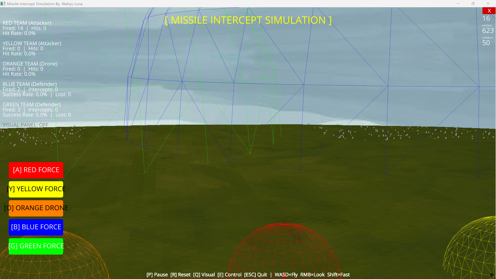
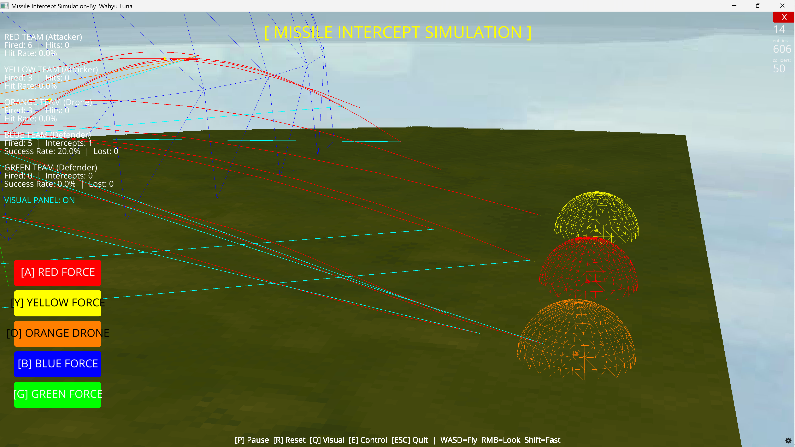
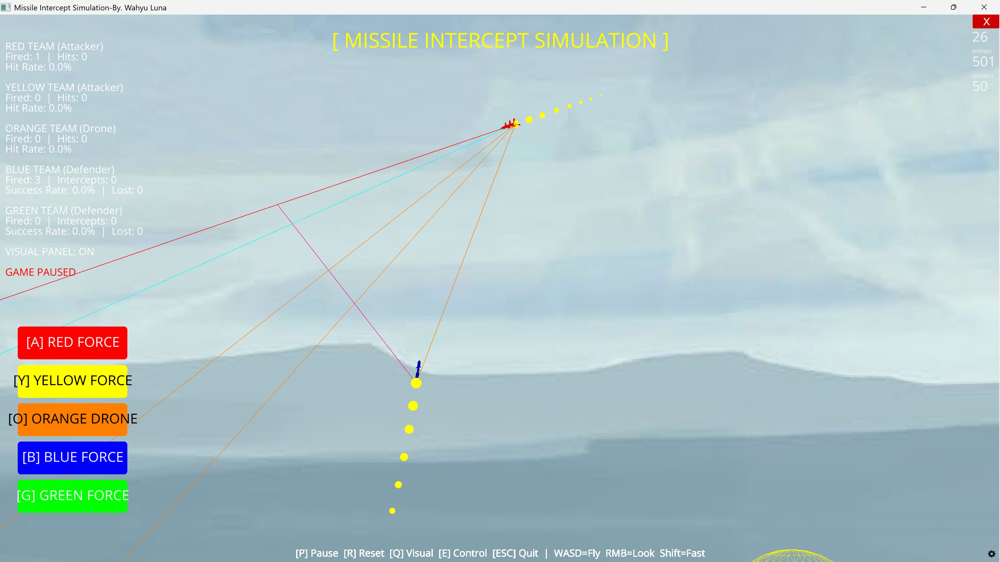
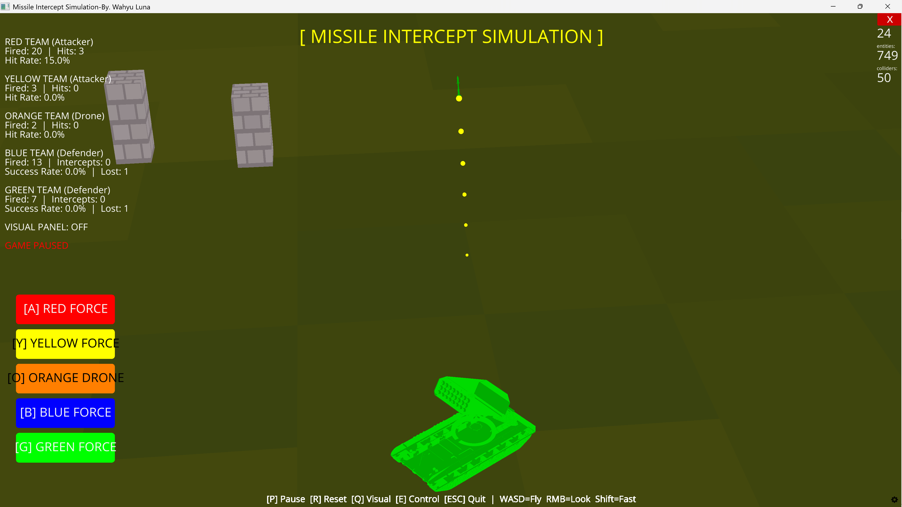
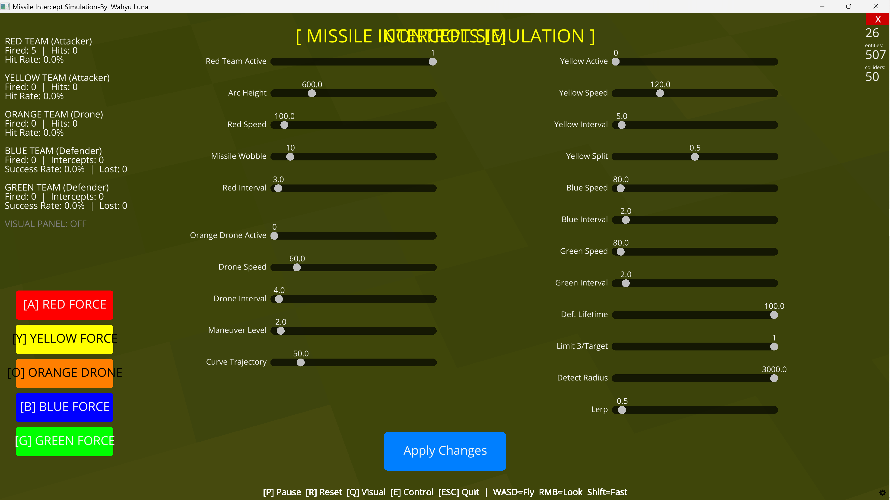

# 🚀 Missile Intercept Simulation 3D

<p align="center">
  
  
  
</p>

<p align="center">
  Simulasi intersepsi misil 3D real-time berbasis Python menggunakan Ursina Engine.
  Menampilkan pertempuran antara tim penyerang (Merah, Kuning, Oranye) melawan tim pertahanan (Biru, Hijau).
</p>

---

## 📋 Daftar Isi

- [Tentang Proyek](#-tentang-proyek)
- [Demo & Screenshot](#-demo--screenshot)
- [Fitur Utama](#-fitur-utama)
- [Arsitektur Sistem](#-arsitektur-sistem)
- [Algoritma Panduan Misil](#-algoritma-panduan-misil)
- [Persyaratan Sistem](#-persyaratan-sistem)
- [Instalasi](#-instalasi)
- [Struktur Folder](#-struktur-folder)
- [Cara Menjalankan](#-cara-menjalankan)
- [Kontrol](#-kontrol)
- [Konfigurasi & Parameter](#-konfigurasi--parameter)
- [Penjelasan Kelas](#-penjelasan-kelas)
- [Catatan Teknis](#-catatan-teknis)
- [Lisensi](#-lisensi)

---

## 🎯 Tentang Proyek

**Missile Intercept Simulation 3D** adalah simulasi pertempuran udara berbasis fisika dalam lingkungan 3D interaktif. Proyek ini dibangun menggunakan [Ursina Engine](https://www.ursinaengine.org/) dan dirancang untuk memvisualisasikan konsep-konsep sistem pertahanan rudal secara edukatif.

Simulasi ini menampilkan:
- Tim **Penyerang** (Merah, Kuning, Oranye) yang meluncurkan misil dan drone ke arah target kota
- Tim **Pertahanan** (Biru, Hijau) yang mengintersepsi ancaman menggunakan misil pencegat
- **Efek visual** ledakan, trail misil, dan kubah deteksi radar
- **Panel kontrol** real-time untuk mengubah parameter simulasi

> ⚠️ **Disclaimer:** Proyek ini dibuat semata-mata untuk tujuan **edukasi dan visualisasi**. Tidak ada informasi militer rahasia yang digunakan atau dipresentasikan.

---

## 🖼️ Demo & Screenshot


```markdown





```

---

## ✨ Fitur Utama

### 🔴 Tim Penyerang

| Tim | Tipe Senjata | Perilaku |
|-----|-------------|----------|
| **Merah (Red)** | Misil Balistik | Lintasan arc + wobble acak pada fase terminal |
| **Kuning (Yellow)** | Misil Cluster | Terbang arc lalu membelah menjadi 10 submunisi (MIRV) |
| **Oranye (Orange)** | Drone Taktis | Terbang rendah dengan kurva-S dan manuver noise acak |

### 🔵 Tim Pertahanan

| Tim | Posisi | Strategi |
|-----|--------|----------|
| **Biru (Blue)** | Kanan-Selatan | Deteksi + intersepsi otomatis, custom pencegat/ancaman(1-5) |
| **Hijau (Green)** | Kanan-Utara | Deteksi + intersepsi otomatis, custom pencegat/ancaman(1-5) |

### 🎮 Fitur Simulasi
- **Kubah deteksi radar** (visualisasi wireframe bola) per tim pertahanan
- **Trail efek** pada setiap misil dan drone
- **Ledakan dinamis** dengan animasi skala dan alpha
- **Visualisasi trajektori** (toggle dengan tombol Q): garis prediksi arc, garis LOS ke target, dan prediksi titik temu
- **Panel kontrol interaktif** (toggle E): ubah kecepatan, interval tembak, tinggi arc, radius deteksi, dll.
- **HUD skor real-time**: misil ditembakkan, berhasil diintersepsi, dan target dihancurkan
- **Kamera bebas** dengan kontrol WASD + RMB

---

## 🏗️ Arsitektur Sistem

```
Advance_sim_3d.py
│
├── Settings (cfg)          → Semua parameter simulasi (kecepatan, posisi, interval, dll)
├── GameState (state)       → State global (skor, daftar misil aktif, timer)
│
├── Kelas Misil Penyerang
│   ├── AttackMissile       → Misil balistik merah dengan wobble
│   ├── YellowAttackMissile → Misil kuning dengan mekanisme split (MIRV)
│   ├── YellowSubmunition   → Submunisi individu pasca-split, dipengaruhi gravitasi
│   └── OrangeDrone         → Drone oranye dengan kurva-S dan manuver noise
│
├── Kelas Misil Pertahanan
│   └── InterceptMissile    → Misil pencegat Biru/Hijau dengan Predictive Pursuit Guidance
│
├── Fungsi Bantu
│   ├── spawn_explosion()   → Animasi ledakan
│   ├── respawn_target()    → Pindahkan gedung yang hancur ke posisi baru
│   └── create_rocket_visual() → Load model 3D OBJ untuk badan misil
│
└── Loop Utama (update())
    ├── Spawn misil berdasarkan timer
    ├── Advance semua misil aktif
    ├── Logika pertahanan Biru & Hijau
    ├── Cek intersepsi & tumbukan tanah
    └── Animasi ledakan & HUD
```

---

## 🧭 Algoritma Panduan Misil

### Misil Penyerang — Ballistic Arc Guidance

Misil Merah dan Kuning menggunakan **lintasan balistik arc** yang telah diprekomputasi. Posisi pada waktu `t` (0.0 → 1.0) dihitung dengan interpolasi linear + offset sinusoidal untuk ketinggian:

```python
def _get_arc_pos(self, t):
    p = lerp(self.origin, self.target, t)
    p.y += arc_height * sin(π * t)   # Puncak di t=0.5
    return p
```

Misil Merah juga menambahkan **wobble lateral** pada fase terminal (`t > 0.5`) untuk mensimulasikan manuver menghindar:

```python
side = wobble_amplitude * sin(wobble_phase + wobble_freq * t * π * 4)
p.z += side * ramp   # ramp: 0→1 saat t: 0.5→1.0
```

### Misil Pertahanan — Predictive Pursuit Guidance (PPG)

Misil pencegat menggunakan **Predictive Pursuit Guidance**, bukan ProNav/TPN. Algoritmanya:

1. **Estimasi kecepatan target** menggunakan finite difference:
   ```python
   target_velocity_vec = (future_target_pos - current_target_pos) / dt_sample
   ```

2. **Hitung waktu terbang ke intersepsi**:
   ```python
   time_to_intercept = distance / (interceptor_speed + target_speed)
   ```

3. **Prediksi titik temu** (intercept point):
   ```python
   intercept_point = target_pos + (target_velocity * time_to_intercept * 0.9)
   ```

4. **Steering dengan Lerp** (untuk belokan halus):
   ```python
   desired_dir = (intercept_point - my_pos).normalized()
   self.current_dir = lerp(self.current_dir, desired_dir, dt * lerp_factor).normalized()
   ```

5. **Gerak**:
   ```python
   self.pos += self.current_dir * self.speed * dt
   ```

> **Catatan Teknis:** Algoritma ini berbeda dari **True Proportional Navigation (TPN)**. TPN menggunakan *Line-of-Sight rate* (λ̇) dan *navigation constant N* untuk menghasilkan perintah akselerasi lateral (`a = N × V_c × λ̇`). PPG yang diimplementasikan di sini lebih sederhana dan cocok untuk simulasi real-time.

### Orange Drone — Curved Path + Noise

Drone oranye tidak menggunakan guidance aktif, melainkan **lintasan terprekomputasi** dengan dua komponen gangguan:

```python
# Kurva-S (meniru manuver evasif)
s_offset.z = sin(t * π * 4) * curve_amplitude

# Noise acak (mensimulasikan ketidakstabilan)
m_offset.y = sin(t * 12 + noise_y) * maneuver_amplitude
m_offset.z += cos(t * 8 + noise_x) * maneuver_amplitude
```

---

## 💻 Persyaratan Sistem

| Komponen | Minimum |
|----------|---------|
| **OS** | Windows 10 / Ubuntu 20.04 / macOS 11 |
| **Python** | 3.12 atau lebih baru |
| **RAM** | 4 GB |
| **GPU** | Mendukung OpenGL 3.3+ |
| **Penyimpanan** | ~200 MB (termasuk aset 3D) |

### Dependensi Python

```
ursina
```

> Ursina secara otomatis menarik dependensi seperti `panda3d`, `pillow`, dan `pyperclip`.

---

## 📦 Instalasi

### 1. Clone Repository

```bash
git clone https://github.com/USERNAME/missile-intercept-simulation.git
cd missile-intercept-simulation
```

### 2. Buat Virtual Environment (Opsional tapi Direkomendasikan)

```bash
python -m venv venv

# Windows
venv\Scripts\activate

# Linux / macOS
source venv/bin/activate
```

### 3. Install Dependensi

```bash
pip install ursina
```

---

## 📁 Struktur Folder

Pastikan struktur folder berikut ada sebelum menjalankan simulasi:

```
missile-intercept-simulation/
│
├──Advance_sim_3d.py       ← File utama simulasi
│
└── 3d asset/
    └── fileobj/
        ├── Launcher_rocket.obj  ← Model peluncur
        ├── Rocket_v1.obj        ← Model drone oranye
        ├── Rocket_v2.obj        ← Model misil merah
        ├── Rocket_v3.obj        ← Model misil kuning
        └── Rocket_v4.obj        ← Model misil pencegat
```

> **Penting:** Script menggunakan path relatif `../3d asset/fileobj/` dari lokasi `Advance_sim_3d.py`.

---

## ▶️ Cara Menjalankan

```bash
python Advance_sim_3d.py
```

Saat pertama dijalankan, akan terlihat konsol output:

```
╔══════════════════════════════════════════════╗
║   MISSILE INTERCEPT SIMULATION  v2  FIXED    ║
╠══════════════════════════════════════════════╣
║  P       = Pause / Resume                    ║
║  R       = Reset                             ║
║  ESC     = Quit                              ║
║  E       = Control Panel                     ║
║  Q       = Visual Panel (Trajectories)       ║
║  WASD    = Fly Movement                      ║
║  RMB     = Look Around                       ║
╚══════════════════════════════════════════════╝
```

---

## 🎮 Kontrol

### Kamera

| Tombol | Fungsi |
|--------|--------|
| `W / A / S / D` | Gerak kamera (depan/kiri/belakang/kanan) |
| `Shift` | Percepat gerakan kamera |
| `RMB + Drag` | Putar pandangan kamera |


### Simulasi

| Tombol | Fungsi |
|--------|--------|
| `P` | Pause / Resume simulasi |
| `R` | Reset simulasi (hapus semua misil, reset skor) |
| `ESC` | Keluar dari program |
| `E` | Buka / tutup panel kontrol parameter |
| `Q` | Toggle visualisasi trajektori |

### Tombol Teleport Kamera (UI)

| Tombol UI | Tujuan |
|-----------|--------|
| `[A] RED FORCE` | Teleport ke posisi tim Merah |
| `[Y] YELLOW FORCE` | Teleport ke posisi tim Kuning |
| `[O] ORANGE DRONE` | Teleport ke posisi tim Oranye |
| `[B] BLUE FORCE` | Teleport ke posisi tim Biru |
| `[G] GREEN FORCE` | Teleport ke posisi tim Hijau |

---

## ⚙️ Konfigurasi & Parameter

Semua parameter dapat diubah melalui **Panel Kontrol (tekan E)** saat simulasi berjalan, atau langsung di kelas `Settings` dalam kode.

### Parameter Penyerang

| Parameter | Default | Deskripsi |
|-----------|---------|-----------|
| `attacker_missile_speed` | `100.0` | Kecepatan misil merah (unit/detik) |
| `attacker_missile_wobble` | `10` | Amplitudo wobble lateral misil merah |
| `attacker_fire_interval` | `3.0` | Interval tembak misil merah (detik) |
| `arc_height` | `600.0` | Ketinggian puncak lintasan arc balistik |
| `yellow_missile_speed` | `120.0` | Kecepatan misil kuning |
| `yellow_split_threshold` | `0.5` | Titik pembelahan misil kuning (0.0-1.0) |
| `orange_drone_speed` | `60.0` | Kecepatan drone oranye |
| `orange_drone_maneuver` | `2.0` | Amplitudo manuver noise drone |
| `orange_drone_curve` | `50.0` | Amplitudo kurva-S drone |

### Parameter Pertahanan

| Parameter | Default | Deskripsi |
|-----------|---------|-----------|
| `blue_missile_speed` | `80.0` | Kecepatan misil pencegat Biru |
| `green_missile_speed` | `80.0` | Kecepatan misil pencegat Hijau |
| `blue_fire_interval` | `2.0` | Interval tembak pencegat Biru (detik) |
| `green_fire_interval` | `2.0` | Interval tembak pencegat Hijau (detik) |
| `defender_detect_radius` | `3000.0` | Radius kubah deteksi radar |
| `defender_missile_lifetime` | `100.0` | Umur maksimum misil pencegat (detik) |
| `limit_intercept_salvo` | `True` | Batasi maks 3 pencegat per ancaman |
| `misile_lerp` | `0.5` | Kelembutan belokan misil pencegat (lebih kecil = lebih lebar) |

### Mengaktifkan / Menonaktifkan Tim

```python
cfg.red_team_active    = True   # Tim Merah aktif
cfg.yellow_team_active = False  # Tim Kuning nonaktif
cfg.orange_team_active = False  # Tim Oranye nonaktif
```

---

## 📚 Penjelasan Kelas

### `AttackMissile`
Misil balistik tim Merah. Menggunakan lintasan arc prekomputasi dengan tambahan efek *wobble* sinusoidal lateral pada separuh terakhir penerbangan untuk mensimulasikan manuver terminal yang sulit diintersepsi.

### `YellowAttackMissile`
Misil kluster tim Kuning. Terbang dengan lintasan arc seperti misil merah, lalu pada titik `split_threshold` membelah diri menjadi **10 submunisi** yang tersebar ke segala arah. Mensimulasikan konsep **MIRV** (Multiple Independently targetable Reentry Vehicle).

### `YellowSubmunition`
Submunisi individual pasca-pembelahan. Setelah diluncurkan dengan kecepatan acak, bergerak mengikuti fisika gravitasi sederhana hingga menghantam tanah dan meledak.

### `OrangeDrone`
Drone taktis ketinggian rendah. Lintasan dipengaruhi oleh dua fungsi gangguan: kurva-S periodik (evasive maneuver) dan noise sinusoidal acak (turbulence / jitter). Lebih lambat dari misil, tapi lebih sulit diprediksi.

### `InterceptMissile`
Misil pencegat tim Biru dan Hijau. Menggunakan **Predictive Pursuit Guidance** untuk memprediksi posisi temu dengan target bergerak. Memiliki `lifetime` terbatas agar tidak terus terbang selamanya jika target hilang.

---

## 🔬 Catatan Teknis

### Tentang Algoritma Panduan

Algoritma panduan yang diimplementasikan pada `InterceptMissile` adalah **Predictive Pursuit Guidance (PPG)**, bukan **True Proportional Navigation (TPN)**. Perbedaan mendasarnya:

| Aspek | TPN (True ProNav) | PPG (Diimplementasikan) |
|-------|-------------------|------------------------|
| Variabel kunci | LOS rate (λ̇) | Prediksi posisi temu |
| Output | Akselerasi lateral | Vektor arah |
| Navigasi Constant (N) | Ada (3–5) | Tidak ada |
| Kompleksitas | Lebih tinggi | Lebih sederhana |


### Fisika yang Disederhanakan

- Gravitasi hanya diterapkan pada `YellowSubmunition`; misil lain tidak terpengaruh gravitasi
- Tidak ada model aerodinamika (drag, lift)
- Deteksi tumbukan menggunakan jarak Euclidean sederhana (radius hit = 8 unit untuk pencegat, 15 unit untuk submunisi)

### Performa

- Semakin banyak misil aktif, semakin berat beban CPU. Disarankan tidak menjalankan lebih dari 30–50 misil aktif sekaligus untuk menjaga performa yang baik.
- Visualisasi trajektori (Q) menambah beban render karena menggambar mesh garis secara dinamis setiap frame.

---

## 🤝 Kontribusi

Kontribusi sangat disambut! Silakan:

1. Fork repositori ini
2. Buat branch fitur baru (`git checkout -b feature/NamaFitur`)
3. Commit perubahan Anda (`git commit -m 'Tambah fitur XYZ'`)
4. Push ke branch (`git push origin feature/NamaFitur`)
5. Buka Pull Request

### Ide Pengembangan

- [ ] Implementasi **True Proportional Navigation (TPN)** yang sesungguhnya
- [ ] Tambahkan **sistem radar** dengan deteksi berbasis sudut (bukan radius bola)
- [ ] Mode **multi-layer defense** (SHORAD + MRAD + THAAD-like layers)
- [ ] **Replay system** untuk memutar ulang simulasi
- [ ] **Export data** statistik intersepsi ke CSV
- [ ] GUI berbasis web menggunakan Ursina + Flask

---


## 🙏 Kredit & Referensi

- **[Ursina Engine](https://www.ursinaengine.org/)** — Game engine Python berbasis Panda3D
- Dibuat dengan bantuan AI untuk keperluan edukasi dan visualisasi konsep sistem pertahanan

---
